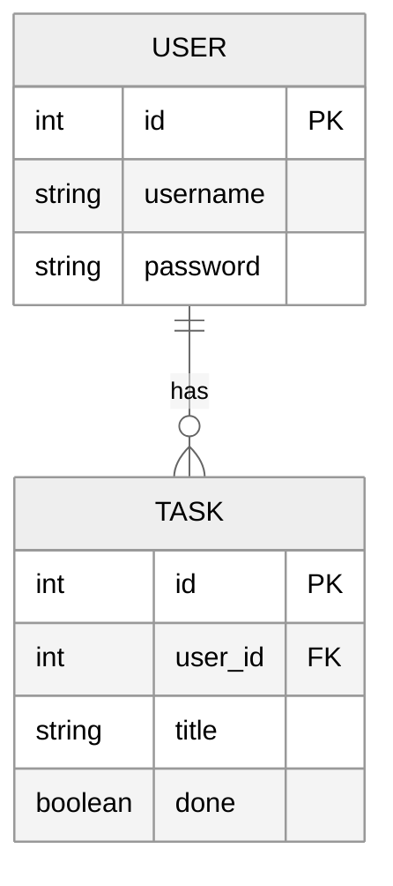

# Task50

###### NOTE: The app is not online anymore since Heroku ended their free tier and I'm broke.

#### Description:

This is my final project for CS50. It is a to-do list web app. You can create, edit and
delete tasks. You can mark them as complete/incomplete.

The name is inspired by CS50's command-line tools `check50` and `submit50`.


## How to use

### Requirements

- Install [Python 3](https://www.python.org/)
- Install [SQLite3](https://www.sqlite.org/)

### Setting up the environment

Open a terminal window, and run the following commands:

```
git clone https://github.com/youssef-attai/task50.git
cd task50
```

If you don't already have `virtualenv` installed, run the following command:

```
pip install virtualenv
```

Run the following commands to setup the environment:

```
virtualenv venv
source venv/bin/activate
pip install -r requirements.txt
```

### Setting up the database

Run the following commands:

```
touch database.db
export DATABASE_URL=sqlite:///database.db
```

Start a Python interactive session by typing in `python` or `python3` then hit `Enter`.

```
from app import db
db.create_all()
exit()
```

Make sure the database is created successfully by running:
```
sqlite3 database.db .tables
```

You should see two new tables created: `user` and `task`.

### Running the app

1. Run the following command:

```
flask run
```

2. Go to http://127.0.0.1:5000, you should see the app working as expected.

### Existing the app

1. Just hit `Ctrl+c` in the terminal window and the server will stop.

## How everything works

- `app.py` is the application controller, it contains the Flask app setup, all the different routes, and model classes.
- `templates/` folder contains all the HTML templates.
- `templates/layout.html` is the base template that all other templates extend, it has important links that need to be
  in every template's `<head>` tag (e.g. Bootstrap CDN links, JQuery CDN link, etc.).
- `templates/register.html` is the template for the Registration page.
- `templates/login.html` is the template for the Login page.
- `templates/home.html` is the template for the main page.
- `templates/dashboard.html` is the template for the Dashboard page, where the user can manage their tasks.
- `templates/edit.html` is the template for the Edit page, where the user can edit a specific task determined via a url
  parameter.
- `Procfile` is a file that tells Heroku how to run the app.
- `requirements.txt` is the result of running `pip freeze`, it includes all the dependencies needed for hosting the
  app.

When the user first opens the app, they have to register a new account.

Every user must have a unique username.

All user inputs are validated server-side only, and not checked in the browser. Once the user registers successfully,
they can log in using their username and password, to be redirected to their dashboard, where they can add new tasks to
their empty to-do list.

Users can edit and delete tasks, as well as marking them as "done" or "not done".

### ER Diagram



### Technologies used

- [Flask](https://flask.palletsprojects.com/en/2.2.x/)
- [Bootstrap](https://getbootstrap.com/docs/5.2/getting-started/introduction/)
- [JQuery](https://jquery.com/)
- [SQLAlchemy](https://www.sqlalchemy.org/)

Authentication is done using [Flask-Login](https://flask-login.readthedocs.io/en/latest/)

Database management is done using [Flask-SQLAlchemy](https://flask-sqlalchemy.palletsprojects.com/en/2.x/)

Password hashing is done using [Flask-Bcrypt](https://flask-bcrypt.readthedocs.io/en/1.0.1/)

HTML forms are done using [Flask-WTF](https://flask-wtf.readthedocs.io/en/1.0.x/)

Icons are from [FontAwesome](https://fontawesome.com/)

### Acknowledgments

- [Stackoverflow answer by Hosein Yeganloo](https://stackoverflow.com/a/44724510/14174934)
- [Stackoverflow answer by Erwin Brandstetter](https://stackoverflow.com/a/11919677/14174934)
- [Stackoverflow answer by Leandro Lima and davidism](https://stackoverflow.com/a/64698899/14174934)
- [Stackoverflow answer by FogleBird and tremendows](https://stackoverflow.com/a/7478705/14174934)
- [Heroku Dev Center - Setting up Postgres](https://devcenter.heroku.com/articles/heroku-postgresql#set-up-postgres-on-linux)
- [Real Python YouTube Video - Deploy a Flask Application on Heroku](https://www.youtube.com/watch?v=4_EO4RwABbA)
- [Codemy.com YouTube Video - Deploy Flask App With Database On Heroku](https://www.youtube.com/watch?v=SiCAIRc0pEI)

# Special thanks

To all of [CS50](https://www.edx.org/course/introduction-computer-science-harvardx-cs50x)'s staff. The course taught me a LOT, and I truly wish I had started my computer science journey with it,
my life would have been much easier.
